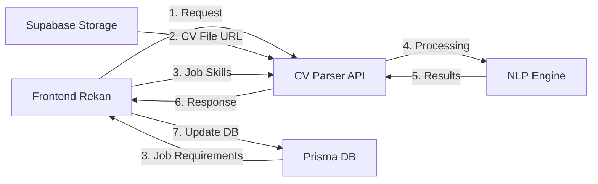

# 🔗 Integration Guide: CV Parser API dengan Frontend

## 📋 Arsitektur Sistem



## 🎯 Flow Integrasi

### **Alur Kerja:**

1. **Frontend** mengirim request ke API Anda dengan:
   - URL CV dari Supabase Storage
   - Required skills dari Prisma database
   - Job ID / Application ID

2. **CV Parser API** (Anda):
   - Download CV dari Supabase URL
   - Parse CV menggunakan NLP
   - Match skills dengan requirement
   - Return hasil recommendation

3. **Frontend** menerima response:
   - Update status pelamar di Prisma
   - Tampilkan hasil ke user

---

## 🔌 API Contract

### **Endpoint:** `POST /api/process-complete`

#### **Request dari Frontend:**

```json
{
  "cv_url": "https://xxx.supabase.co/storage/v1/object/public/cvs/applicant-123.pdf",
  "job_id": "job-456",
  "application_id": "app-789",
  "job_title": "Textile Quality Control Supervisor",
  "required_skills": [
    "Quality Control",
    "Textile Testing",
    "Leadership",
    "Microsoft Excel",
    "ISO 9001"
  ]
}
```

#### **Response ke Frontend:**

**Jika RECOMMENDED (ada skill yang match):**
```json
{
  "success": true,
  "data": {
    "application_id": "app-789",
    "job_id": "job-456",
    "job_title": "Textile Quality Control Supervisor",
    "candidate": {
      "name": "John Doe",
      "email": "john@example.com",
      "phone": "+6281234567890",
      "skills": [
        "Quality Control",
        "Textile Testing",
        "Leadership",
        "Microsoft Excel",
        "Team Management"
      ]
    },
    "matching": {
      "matches": [
        {
          "required": "Quality Control",
          "matched": "Quality Control",
          "score": 100,
          "is_match": true,
          "match_type": "Exact"
        },
        {
          "required": "Textile Testing",
          "matched": "Textile Testing",
          "score": 100,
          "is_match": true,
          "match_type": "Exact"
        },
        {
          "required": "Leadership",
          "matched": "Leadership",
          "score": 100,
          "is_match": true,
          "match_type": "Exact"
        },
        {
          "required": "Microsoft Excel",
          "matched": "Microsoft Excel",
          "score": 100,
          "is_match": true,
          "match_type": "Exact"
        },
        {
          "required": "ISO 9001",
          "matched": null,
          "score": 0,
          "is_match": false,
          "match_type": null
        }
      ],
      "statistics": {
        "total_required": 5,
        "matched_count": 4,
        "match_percentage": 80.0
      }
    },
    "recommendation": {
      "status": "RECOMMENDED",
      "score": 80.0
    }
  }
}
```

**Jika NOT RECOMMENDED (tidak ada skill yang match):**
```json
{
  "success": false,
  "reason": "NOT_RECOMMENDED",
  "message": "No matching skills found",
  "application_id": "app-789",
  "job_id": "job-456"
}
```

> **Note:** Kandidat yang NOT RECOMMENDED tidak mengembalikan data lengkap. Frontend hanya perlu log atau skip kandidat ini.

---

## 💻 Implementasi di Frontend (Rekan Anda)

### **1. Fetch Job Requirements dari Prisma**

```typescript
// Di Next.js API Route atau Server Action
import { prisma } from '@/lib/prisma'

async function getJobWithSkills(jobId: string) {
  const job = await prisma.jobs.findUnique({
    where: { id: jobId },
    select: {
      id: true,
      title: true,
      companyId: true,
      job_skills: {
        select: {
          skills: {
            select: {
              name: true
            }
          },
          isRequired: true,
          proficiencyLevel: true
        }
      }
    }
  })
  
  // Extract skill names
  const requiredSkills = job.job_skills
    .filter(js => js.isRequired)
    .map(js => js.skills.name)
  
  return {
    ...job,
    requiredSkills
  }
}
```

### **2. Kirim Request ke CV Parser API**

```typescript
// Di Next.js API Route: /api/process-cv
export async function POST(request: Request) {
  const { applicationId } = await request.json()
  
  // 1. Get application data
  const application = await prisma.applications.findUnique({
    where: { id: applicationId },
    include: {
      jobs: {
        include: {
          job_skills: {
            where: { isRequired: true },
            include: {
              skills: true
            }
          }
        }
      },
      jobseekers: {
        select: {
          resumeUrl: true,
          cvUrl: true
        }
      }
    }
  })
  
  if (!application) {
    return Response.json({ error: 'Application not found' }, { status: 404 })
  }
  
  // 2. Get CV URL (prioritas: resumeUrl > cvUrl dari application > cvUrl dari jobseeker)
  const cvUrl = application.resumeUrl || 
                application.jobseekers.cvUrl || 
                application.jobseekers.resumeUrl
  
  if (!cvUrl) {
    return Response.json({ error: 'No CV found' }, { status: 400 })
  }
  
  // 3. Extract required skills
  const requiredSkills = application.jobs.job_skills.map(js => js.skills.name)
  
  // 4. Call CV Parser API
  const response = await fetch(process.env.CV_PARSER_API_URL + '/api/process-complete', {
    method: 'POST',
    headers: {
      'Content-Type': 'application/json',
    },
    body: JSON.stringify({
      cv_url: cvUrl,
      job_id: application.jobId,
      application_id: application.id,
      job_title: application.jobs.title,
      required_skills: requiredSkills,
    }),
  })
  
  const result = await response.json()
  
  // 5. Update application status di Prisma
  if (result.success) {
    // RECOMMENDED - Save full candidate data
    await prisma.applications.update({
      where: { id: applicationId },
      data: {
        status: 'SHORTLISTED', // atau 'REVIEWING'
        recruiterNotes: JSON.stringify({
          aiParsing: {
            matchScore: result.data.recommendation.score,
            matchedSkills: result.data.matching.statistics.matched_count,
            totalRequired: result.data.matching.statistics.total_required,
            candidateSkills: result.data.candidate.skills,
            parsedAt: new Date(),
          }
        }),
        reviewedAt: new Date(),
      },
    })
  } else if (result.reason === 'NOT_RECOMMENDED') {
    // NOT RECOMMENDED - Mark as rejected
    await prisma.applications.update({
      where: { id: applicationId },
      data: {
        status: 'REJECTED',
        rejectionReason: 'No matching skills found via AI screening',
        reviewedAt: new Date(),
      },
    })
  }
  
  return Response.json(result)
}
```

### **3. Frontend Component (React/Next.js)**

```typescript
'use client'

import { useState } from 'react'

export function ApplicationProcessor({ applicationId, jobId, cvUrl }) {
  const [loading, setLoading] = useState(false)
  const [result, setResult] = useState(null)
  
  const processCV = async () => {
    setLoading(true)
    
    try {
      const response = await fetch('/api/process-cv', {
        method: 'POST',
        headers: { 'Content-Type': 'application/json' },
        body: JSON.stringify({ applicationId, jobId, cvUrl }),
      })
      
      const data = await response.json()
      setResult(data)
    } catch (error) {
      console.error('Error:', error)
    } finally {
      setLoading(false)
    }
  }
  
  return (
    <div>
      <button onClick={processCV} disabled={loading}>
        {loading ? 'Processing...' : 'Process CV'}
      </button>
      
      {result?.success && (
        <div className="results">
          <h3>Recommendation: {result.data.recommendation.status}</h3>
          <p>Match Score: {result.data.recommendation.score}%</p>
          <p>Candidate: {result.data.candidate.name}</p>
        </div>
      )}
    </div>
  )
}
```

---

## 🗄️ Schema Prisma (Actual Structure)

Berdasarkan schema rekan Anda, struktur yang sudah ada:

### **Relevant Models:**

```prisma
model applications {
  id                     String                   @id
  jobId                  String
  jobseekerId            String
  coverLetter            String?
  resumeUrl              String?              // CV URL dari application
  portfolioUrl           String?
  answers                Json?
  status                 ApplicationStatus    @default(PENDING)
  appliedAt              DateTime             @default(now())
  reviewedAt             DateTime?
  recruiterNotes         String?              // Bisa simpan AI parsing result di sini (JSON)
  rejectionReason        String?
  // ... other fields
  jobs                   jobs                 @relation(...)
  jobseekers             jobseekers           @relation(...)
}

model jobs {
  id                  String          @id @default(cuid())
  companyId           String
  recruiterId         String
  title               String
  description         String
  requirements        String
  // ... other fields
  job_skills          job_skills[]    // Skills untuk job ini
  applications        applications[]
}

model job_skills {
  id               String   @id @default(cuid())
  jobId            String
  skillId          String
  isRequired       Boolean  @default(true)     // Apakah skill ini required?
  proficiencyLevel String?                     // Level yang dibutuhkan
  jobs             jobs     @relation(...)
  skills           skills   @relation(...)
  
  @@unique([jobId, skillId])
}

model skills {
  id               String             @id @default(cuid())
  name             String             @unique
  category         String?
  job_skills       job_skills[]
  jobseeker_skills jobseeker_skills[]
}

model jobseekers {
  id                  String             @id
  userId              String             @unique
  firstName           String?
  lastName            String?
  email               String?
  phone               String?
  resumeUrl           String?            // CV URL dari jobseeker profile
  cvUrl               String?            // Alternative CV URL
  // ... other fields
  applications        applications[]
  jobseeker_skills    jobseeker_skills[]
}
```

### **How to Use:**

#### **1. Get Required Skills untuk Job:**

```typescript
const job = await prisma.jobs.findUnique({
  where: { id: jobId },
  include: {
    job_skills: {
      where: { isRequired: true },  // Hanya required skills
      include: {
        skills: true
      }
    }
  }
})

// Extract skill names
const requiredSkills = job.job_skills.map(js => js.skills.name)
// Result: ["Quality Control", "Leadership", "Microsoft Excel"]
```

#### **2. Store AI Parsing Results:**

Gunakan field `recruiterNotes` di `applications` untuk simpan hasil parsing:

```typescript
await prisma.applications.update({
  where: { id: applicationId },
  data: {
    status: 'SHORTLISTED',  // atau 'REVIEWING'
    recruiterNotes: JSON.stringify({
      aiParsing: {
        parsedAt: new Date(),
        matchScore: 85.5,
        matchedSkills: 4,
        totalRequired: 5,
        candidateSkills: ["Quality Control", "Leadership", ...],
        recommendation: "RECOMMENDED"
      }
    }),
    reviewedAt: new Date()
  }
})
```

#### **3. Alternative: Add New Fields (Optional)**

Jika ingin fields dedicated untuk AI parsing, bisa tambahkan migration:

```prisma
model applications {
  // ... existing fields ...
  
  // AI Parsing fields (optional)
  aiMatchScore        Float?
  aiMatchedSkills     Int?
  aiTotalRequired     Int?
  aiCandidateSkills   String[]  // Array of matched skills
  aiProcessedAt       DateTime?
  aiRecommendation    String?   // "RECOMMENDED" or "NOT_RECOMMENDED"
}
```

Tapi untuk MVP, cukup gunakan `recruiterNotes` (JSON) yang sudah ada.

---

## 🔐 Security Considerations

### **1. API Authentication (Opsional tapi Disarankan)**

Tambahkan API key untuk keamanan:

```python
# Di app.py
API_KEY = os.environ.get('API_KEY', 'your-secret-key')

@app.before_request
def check_api_key():
    if request.path.startswith('/api/') and request.path != '/api/health':
        api_key = request.headers.get('X-API-Key')
        if api_key != API_KEY:
            return jsonify({'error': 'Unauthorized'}), 401
```

```typescript
// Di frontend
const response = await fetch('https://your-api.railway.app/api/process-complete', {
  headers: {
    'Content-Type': 'application/json',
    'X-API-Key': process.env.CV_PARSER_API_KEY,
  },
  // ...
})
```

### **2. CORS Configuration**

Pastikan CORS hanya allow domain frontend:

```python
from flask_cors import CORS

ALLOWED_ORIGINS = os.environ.get('ALLOWED_ORIGINS', '*').split(',')

CORS(app, origins=ALLOWED_ORIGINS)
```

---

## 📊 Recommendation Logic

Sistem recommendation yang sederhana:

| Kondisi | Status | Response | Keterangan |
|---------|--------|----------|------------|
| Ada skill yang match (matched_count > 0) | RECOMMENDED | `success: true` + full data | Kandidat memiliki minimal 1 skill yang sesuai, kirim data lengkap ke frontend |
| Tidak ada skill yang match (matched_count = 0) | NOT RECOMMENDED | `success: false` + reason only | Kandidat tidak memiliki skill yang sesuai, **tidak kirim data kandidat** |

**Keuntungan:**
- Frontend hanya menerima kandidat yang RECOMMENDED
- Database lebih bersih, hanya simpan kandidat potensial
- Lebih fokus pada kandidat yang qualified

---

## 🧪 Testing

### **Test dengan cURL:**

```bash
curl -X POST https://your-api.railway.app/api/process-complete \
  -H "Content-Type: application/json" \
  -d '{
    "cv_url": "https://xxx.supabase.co/storage/v1/object/public/cvs/test.pdf",
    "job_id": "job-123",
    "application_id": "app-456",
    "job_title": "Quality Control Supervisor",
    "required_skills": ["Quality Control", "Leadership", "Excel"]
  }'
```

### **Test dari Frontend (Postman/Thunder Client):**

1. Upload CV ke Supabase Storage
2. Get public URL
3. Send POST request dengan URL tersebut

---

## 📝 Checklist Implementasi

### **Di Sisi Anda (CV Parser API):**
- [x] API endpoint `/api/process-complete` sudah ada
- [ ] Deploy ke Railway
- [ ] Set environment variables
- [ ] Test dengan sample CV
- [ ] Share API URL ke rekan

### **Di Sisi Rekan (Frontend):**
- [ ] Update Prisma schema
- [ ] Buat API route untuk call CV Parser
- [ ] Implement UI untuk trigger processing
- [ ] Handle response dan update database
- [ ] Display results ke user

---

## 🚀 Deployment Checklist

1. **Railway Environment Variables:**
   ```
   FLASK_ENV=production
   PORT=5000
   ALLOWED_ORIGINS=https://frontend-domain.com
   API_KEY=your-secret-key-here
   ```

2. **Test Health Check:**
   ```
   https://your-api.railway.app/api/health
   ```

3. **Share dengan Rekan:**
   - API Base URL
   - API Key (jika pakai)
   - API Documentation (contract di atas)

---

## 💡 Tips

1. **Async Processing:** Untuk CV besar, pertimbangkan queue system (Celery/Redis)
2. **Caching:** Cache hasil parsing untuk CV yang sama
3. **Logging:** Log semua request untuk debugging
4. **Rate Limiting:** Batasi request per IP/user
5. **Webhook:** Alternatif: Frontend kirim webhook URL, API callback setelah selesai

---

## 📞 Support

Jika ada pertanyaan tentang integrasi, hubungi:
- API Developer: [Your Contact]
- Frontend Developer: [Rekan Contact]
